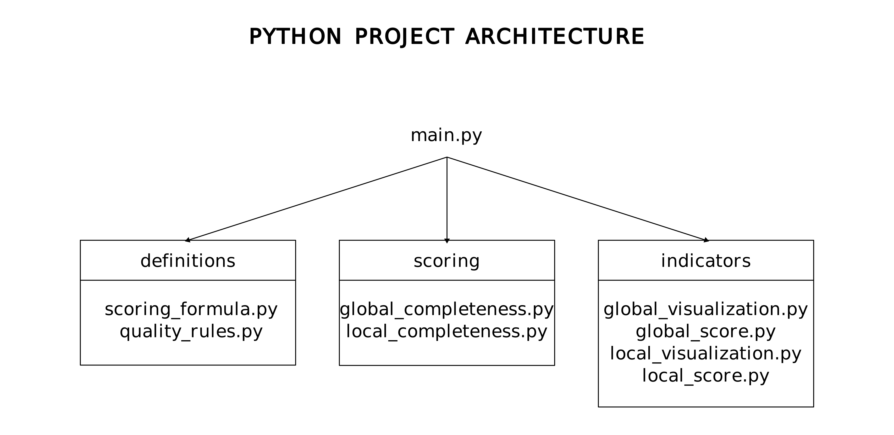

# Data Quality Scoring Tool

## Presentation

This program aims at providing different data quality scores and visualization of a given dataset.

First of all, it is concerned with data completeness. It will provide:
 + a percentage of null values for each field, either globally – i.e. for the whole data set –, or locally – i.e. for a given instance of the data set;
 + a score of the data completeness according to a scoring formula with weights related to specific fields previously defined by the data provider;
 + data visualizations to get the big picture and eventually identify outliers.

Secondly, it will suggests improvements to the user.

## Functional Schema

1. Inputs:
 + **Scoring Formula**: this is where are defined the weights to the corresponding fields. For example, the field *POI_name* has a 0.05 weight of the total score (which is equal to 1).
 + **Dataset .csv/.json**: can welcome different types of data sets
 + **Quality Rules**: this is where an empty value is defined, e.g.: equal to "null", "0", etc.

2. Scripts:
 + **Local Completeness Scoring**: instance granularity. Scoring presupposes that the scoring formula and a standard data model have been defined beforehand, while percentage information about completeness does not.
 + **Global Completeness Scoring**: whole dataset granularity. Scoring presupposes that the scoring formula and a standard data model have been defined beforehand, while simple percentage information about completeness does not.

3. Outputs:
 + **Global Completeness Score/Visualization**: in addition to the completeness score and percentage information, different data visualizations are proposed.
 + **Local Completeness Score/Visualization**: in addition to the completeness score and percentage information, different data visualizations are proposed.
 + **Improvement Suggestions**: depending on the type of data (numerical (discrete, continuous), categorical or ordinal), it suggests a default value (mean, most frequent, median, previous value, etc.) to the user. Caution with this functionality.

## Python Project Architecture Schema

It is organized with three folders and a **main.py** file:
 + **definitions**: contains the files where are defined the scoring formula and the quality rules
 + **scoring**: where the data is assessed with scoring scripts
 + **indicators**: contains all output files displaying the different scores or data visualization
 + **main.py**: orchestrates and executes the different above-mentioned scripts

Later will be added:
 + **suggestions**: folder that contains scripts to suggest improvements to the user.

